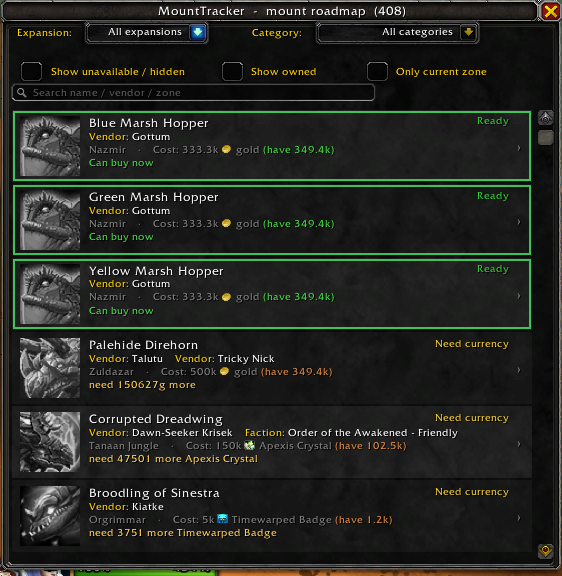
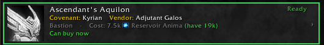
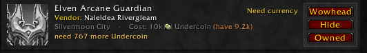
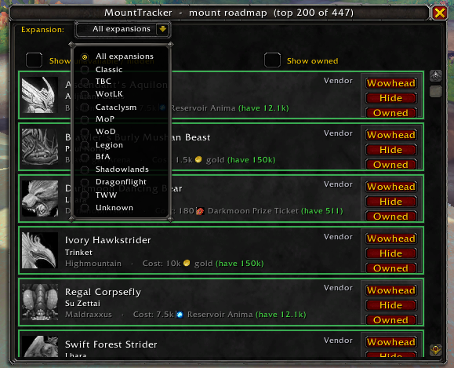
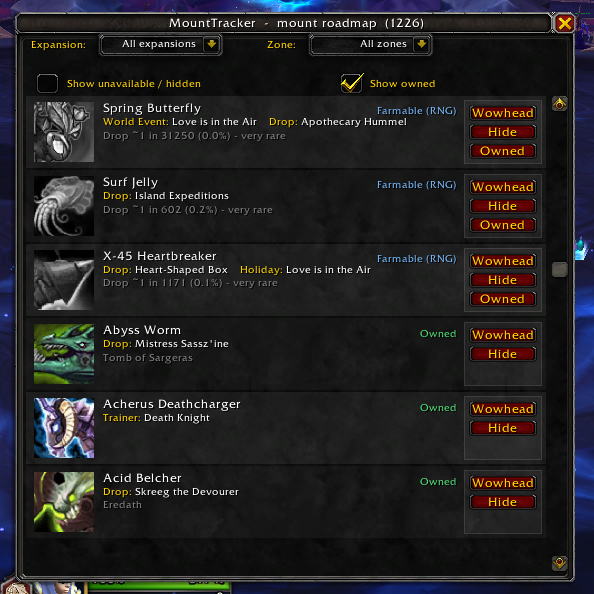
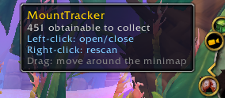

<div align="center">

# 🐎 MountTracker

### Your personal mount-collecting roadmap — surfacing the mounts you can grab *right now* but didn't know about.

**Language:** **English** · [Português (BR)](README.pt-BR.md)


</div>

---

## ✨ Why MountTracker?

There are plenty of addons that list the mounts you're missing. **None of them tell you which ones you can already claim.**

You've been playing for years. Somewhere along the way you hit **Exalted** with a faction, finished an **achievement**, or stockpiled a **currency** — and the mount tied to it has just been sitting there, unclaimed, because the game never told you.

> **MountTracker's killer feature:** it cross-references your *live* reputation, currencies, gold and achievements against every mount you don't own, and **lights up the ones you're already eligible for** with a pulsing green border. No more "wait, I could have had this the whole time?"

It then builds a **roadmap** of everything else, sorted from *easiest to obtain* to *hardest*, with the exact vendor, location, cost, and how much of that currency you currently hold.

---

## 🎯 What it does

- **Tracks your whole account's collection** live from the Mount Journal.
- **Builds a prioritized roadmap** of missing mounts — easiest first.
- **Detects hidden eligibility** — the green glow means *"you can get this now."*
- **Shows you exactly how to get each mount:** vendor name, zone, cost (with currency icon **and how much you own**), or the drop source and its rate.
- **Filters out what you can't get** — opposite-faction, class-locked, and legacy/unobtainable mounts are hidden by default (and one click away when you want them).
- **Filter by expansion**, toggle owned/unavailable, and manage your list manually.

---

## 🚀 Features at a glance

| Feature | Description |
|---|---|
| 🟢 **Obtainable-now glow** | A pulsing border on any mount whose requirements you already meet (reputation OK + currency/gold OK). |
| 🗺️ **Full-collection coverage** | Every missing mount in the game, using the game's own source data — not a hand-typed list. |
| 💰 **Currency "have" tracker** | Costs show the icon, name **and your current balance** — green when you can afford it, orange when you can't. |
| 🎲 **Drop-rate grading** | RNG drops are ranked by their odds: `1/25` is "go farm it," `1/200` sinks to the bottom — each shown with its percentage. |
| ⚔️ **Smart faction filter** | Uses the game's own visibility signal to correctly hide opposite-faction and class-locked mounts (not just the "paired" ones other tools miss). |
| 📂 **Expansion filter** | Narrow the roadmap to Classic, TBC, WotLK … all the way to The War Within and Midnight. |
| 🏷️ **Curated overlay** | Hand-verified data (from Wowhead) adds precise eligibility detection, drop rates and Wowhead links on top of the live base. |
| 🧭 **Minimap button** | Drag it anywhere around the ring; click to open. Zero external libraries. |
| 🔗 **One-click Wowhead** | Every mount has a Wowhead link — copy it straight from the row. |
| 🛡️ **No mid-screen errors** | Every entry point is sandboxed; if something fails you get a quiet chat message, never a Lua error popup. |
| 🔒 **Midnight Secret-Value safe** | Handles the 12.0 "Secret Value" API gracefully instead of breaking. |
| 🪶 **Zero dependencies** | Pure Blizzard API. No Ace3, no LibDBIcon, nothing to install alongside it. |

---

## 📸 Screenshots



*The roadmap — your missing mounts, easiest first, each with vendor, location and **cost vs. your balance**.*

| | |
|:---:|:---:|
|  |  |
| **Green glow = you can get it right now** | Vendor(s), zone and `Cost: N (have X)` |
|  |  |
| Filter by expansion | Owned (colored) vs. missing (gray) |

<p align="center"><br><em>Drag the minimap button anywhere; click to open.</em></p>

---

## 📥 Installation

**Manual (for now):**

1. Download this repository (green **Code → Download ZIP**), or clone it.
2. Extract the `MountTracker` folder into:
   ```
   World of Warcraft\_retail_\Interface\AddOns\
   ```
   (The folder must be named `MountTracker` and contain `MountTracker.toc`.)
3. Restart the game, or `/reload` if it was already running.
4. Make sure **MountTracker** is enabled in the AddOns list on the character screen.

> Targeting **Midnight 12.0.5** (`## Interface: 120005`). Playing a different build? Just edit the `## Interface:` line at the top of `MountTracker.toc`, or tick *"Load out of date AddOns."*

---

## 🕹️ Usage

Open the window from the **minimap button** or with a slash command:

| Command | What it does |
|---|---|
| `/mtrack` (or `/mtr`, `/mounttracker`) | Open / close the roadmap window |
| `/mtrack scan` | Print a summary to chat (owned / obtainable / unavailable) |
| `/mtrack find <name>` | Look up a mount's internal ID |
| `/mtrack minimap` | Show / hide the minimap button |
| `/mtrack reset` | Clear your manual overrides (marked-owned / hidden) |
| `/mtrack debug` | Toggle technical error details |
| `/mtrack help` | List all commands |

**In the window:**
- **Wowhead** — copy the mount's Wowhead link.
- **Hide** — hide a mount you don't care about.
- **Owned** — mark a mount as owned (fixes a wrongly-tracked one).
- Use the **Expansion** dropdown and the **Show owned / Show unavailable** checkboxes to shape the list.

---

## 🧠 How it works

MountTracker uses a **hybrid model**:

1. **Live base — total coverage.** It reads *every* mount from the Mount Journal and uses the game's own `sourceText` (vendor, zone, faction, renown, quest) to describe how to get each one. This covers the entire game with zero manual data and is always up to date.
2. **Curated overlay — the magic.** A hand-verified table (sourced from Wowhead, keyed by spell ID) sits on top and adds what the API can't: precise **eligibility detection** (do you already meet the reputation/currency requirement?), **drop rates**, and **Wowhead links**.

Eligibility, currency balances and reputation are read **live** every time, so the roadmap always reflects your character's real state — including correctly handling Midnight's **Secret Values**.

A built-in `/mtrack dump` tool exports your journal so contributors can expand the curated overlay with accurate, language-independent data.

---

## 🗺️ Project status & roadmap

MountTracker is in **active development**. The live base already covers the whole collection; the curated eligibility overlay is being expanded **expansion by expansion** (Classic → TBC → WotLK → …).

- [x] Live base over the full Mount Journal
- [x] Hidden-eligibility detection + obtainable-now glow
- [x] Currency "have", drop-rate grading, faction & expansion filters
- [x] Minimap button, manual overrides, error-safety
- [ ] Full curated eligibility overlay across all expansions
- [ ] Boss/dungeon → expansion mapping (shrink the "Unknown" bucket)
- [ ] Optional TomTom waypoints

---

## 🤝 Contributing

Curation help is very welcome! The most valuable contribution is **verified acquisition data** for mounts (spell ID, faction/standing, vendor, cost, drop rate, Wowhead link).

1. Run `/mtrack dump` in game, then `/reload`.
2. The export lands in your `SavedVariables\MountTracker.lua`.
3. Open an issue or PR with the data — or just the dump and we'll convert it.

Bug reports and UI feedback are equally appreciated. Please include the output of `/mtrack debug` if you hit an error.

---

## ❓ FAQ

**Does it work for the opposite faction / other classes?**
Mounts your character can't obtain are hidden by default (using the game's own signal). Tick **"Show unavailable / hidden"** to see them.

**Why is a mount under "Unknown" expansion?**
Its source text doesn't mention a recognizable zone (common for boss drops, professions and holidays). It's still in the list — just in the catch-all bucket.

**Are drop rates exact?**
No — they're community estimates (Wowhead). Treat them as a guide, not gospel.

**Does it need any other addon?**
No. It's pure Blizzard API with zero dependencies.

---

## 📜 License

Released under the **MIT License** — free to use, study and improve. See `LICENSE`.

> _World of Warcraft and related assets are trademarks of Blizzard Entertainment. This is an unofficial, fan-made addon._

---

<div align="center">

Made for the WoW mount-collecting community.
**Happy hunting**

</div>
