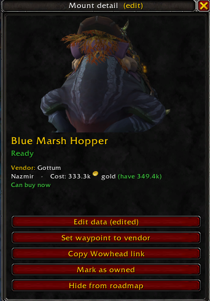
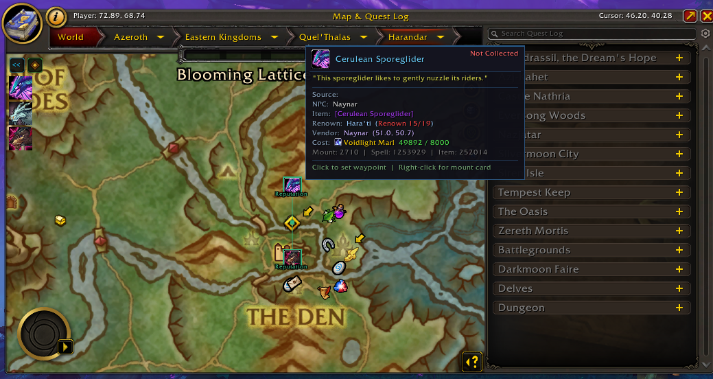
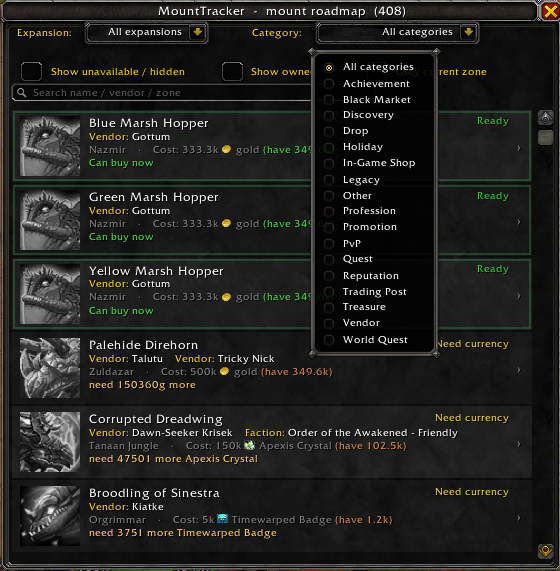
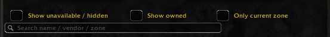
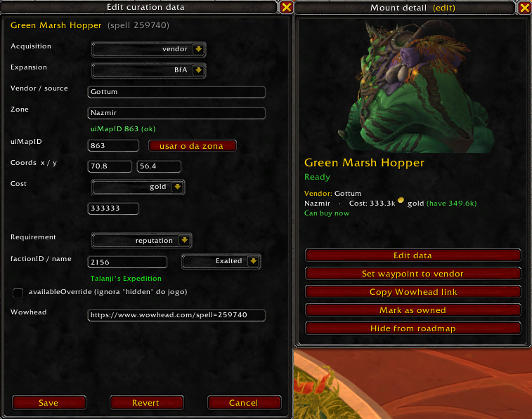

<div align="center">

# 🐎 MountTracker

### Seu roadmap pessoal de coleção de montarias — revelando as que você já pode pegar *agora* e nem sabia.

**Idioma:** [English](README.md) · **Português (BR)**


</div>

---

## ✨ Por que o MountTracker?

Existem vários addons que listam as montarias que faltam pra você. **Nenhum deles te diz quais você já pode reivindicar.**

Você joga há anos. Em algum momento atingiu **Exaltado** com uma facção, completou uma **conquista** ou acumulou uma **moeda** — e a montaria ligada àquilo ficou lá, parada, sem ser coletada, simplesmente porque o jogo nunca te avisou.

> **O recurso-estrela do MountTracker:** ele cruza, *ao vivo*, sua reputação, moedas, ouro e conquistas com todas as montarias que você não tem, e **acende as que você já é elegível** com uma borda verde pulsante. Acabou o "peraí, eu podia ter isso esse tempo todo?".

E então monta um **roadmap** de tudo o que falta, ordenado da *mais fácil de obter* para a *mais difícil*, com o vendedor exato, o local, o custo e quanto daquela moeda você tem no bolso.

---

## 🎯 O que ele faz

- **Acompanha a coleção da conta inteira** ao vivo, pelo Mount Journal.
- **Monta um roadmap priorizado** das montarias que faltam — as mais fáceis primeiro.
- **Detecta elegibilidade oculta** — o brilho verde significa *"dá pra pegar agora."*
- **Mostra exatamente como obter cada montaria:** nome do vendedor, zona, custo (com ícone da moeda **e quanto você possui**), ou a fonte do drop e a taxa.
- **Esconde o que você não pode pegar** — montarias da facção oposta, travadas por classe e legacy/inobteníveis ficam ocultas por padrão (e a um clique de distância quando você quiser).
- **Filtro por expansão**, alternar obtidas/indisponíveis e gerenciar a lista manualmente.

---

## 🚀 Recursos num relance

| Recurso | Descrição |
|---|---|
| 🟢 **Brilho de "dá pra pegar agora"** | Borda pulsante em qualquer montaria cujos requisitos você já cumpre (reputação OK + moeda/ouro OK). |
| 🗺️ **Cobertura da coleção inteira** | Todas as montarias que faltam no jogo, usando os dados do próprio jogo — não uma lista digitada à mão. |
| 💰 **Rastreador de moeda ("have")** | O custo mostra o ícone, o nome **e o seu saldo atual** — verde quando dá pra comprar, laranja quando não. |
| 🎲 **Graduação por drop rate** | Drops de RNG são ranqueados pela chance: `1/25` é "vai farmar," `1/200` afunda pro fim — cada um com sua porcentagem. |
| ⚔️ **Filtro de facção inteligente** | Usa o sinal de visibilidade do próprio jogo pra esconder corretamente montarias da facção oposta e travadas por classe (não só as "pareadas" que outras ferramentas erram). |
| 📂 **Filtro por expansão** | Restrinja o roadmap a Classic, TBC, WotLK … até The War Within e Midnight. |
| 🔎 **Busca textual** | Um campo de texto livre filtra o roadmap por nome, vendedor ou zona — combine com os outros filtros pra achar uma montaria específica rápido. |
| 🏷️ **Overlay curado** | Dados verificados à mão (do Wowhead) adicionam detecção precisa de elegibilidade, drop rates e links do Wowhead por cima da base ao vivo. |
| ✎ **Editor de curadoria in-game** | Ferramenta de contribuidor: edite os dados de aquisição de uma montaria (vendedor, custo, requisito, coords…) direto no painel de detalhe e veja o roadmap atualizar ao vivo. Veja a nota abaixo antes de usar. |
| 🧭 **Botão de minimapa** | Arraste pra qualquer ponto da borda; clique pra abrir. Zero bibliotecas externas. |
| 🔗 **Wowhead num clique** | Toda montaria tem link do Wowhead — copie direto da linha. |
| 🛡️ **Sem erro no meio da tela** | Todo ponto de entrada é blindado; se algo falha, você recebe uma mensagem discreta no chat, nunca um popup de erro Lua. |
| 🔒 **Compatível com Secret Values do Midnight** | Lida com a API de "Secret Value" do 12.0 com elegância, em vez de quebrar. |
| 🪶 **Zero dependências** | API pura do Blizzard. Sem Ace3, sem LibDBIcon, nada pra instalar junto. |

---

## 📸 Capturas de tela


*O roadmap — as montarias que faltam, da mais fácil primeiro, cada uma com vendedor, local e **custo vs. seu saldo**.*

| | |
|:---:|:---:|
|  |  |
| **Brilho verde = dá pra pegar agora** | Linhas limpas, clique pra abrir |
|  |  |
| Clique numa montaria → painel com **modelo 3D** + ações | Um clique cria um **waypoint** até o vendedor |
|  |  |
| Filtro por expansão | Filtro por categoria (Vendor / Reputação / Drop / …) |
|  |  |
| Busca textual + toggles (zona atual, obtidas, indisponíveis) | Obtidas (coloridas) vs. faltantes (cinza) |
|  |  |
| Botão de minimapa — arraste e clique pra abrir | Editor de curadoria in-game (ferramenta de contribuidor) |

---

## 📥 Instalação

1. Baixe o **[`MountTracker.zip`](../../releases/latest/download/MountTracker.zip)** (sempre a release mais recente).
   *(Não use o link "Source code (zip)" — esse não carrega no jogo.)*
2. Extraia para:
   ```
   World of Warcraft\_retail_\Interface\AddOns\
   ```
   (Vai gerar uma pasta `MountTracker` com o `MountTracker.toc`.)
3. Reinicie o jogo, ou dê `/reload` se já estava aberto.
4. Confirme que o **MountTracker** está marcado na lista de AddOns na tela de personagem.

> Alvo: **Midnight 12.0.5** (`## Interface: 120005`). Jogando outra build? Edite a linha `## Interface:` no topo do `MountTracker.toc`, ou marque *"Carregar AddOns desatualizados."*

---

## 🕹️ Uso

Abra a janela pelo **botão de minimapa** ou por um slash command:

| Comando | O que faz |
|---|---|
| `/mtrack` (ou `/mtr`, `/mounttracker`) | Abre / fecha a janela do roadmap |
| `/mtrack scan` | Imprime um resumo no chat (obtidas / obteníveis / indisponíveis) |
| `/mtrack find <nome>` | Procura o ID interno de uma montaria |
| `/mtrack minimap` | Mostra / esconde o botão do minimapa |
| `/mtrack enable edit` / `/mtrack disable edit` | Liga / desliga o editor de curadoria in-game (veja abaixo) |
| `/mtrack export` | Lista suas edições manuais pendentes (para contribuir) |
| `/mtrack reset` | Limpa seus overrides manuais (marcada-obtida / oculta) |
| `/mtrack debug` | Liga / desliga o detalhe técnico de erros |
| `/mtrack help` | Lista todos os comandos |

**Na janela:**
- **Campo de busca** — digite parte do nome, vendedor ou zona pra filtrar o roadmap.
- **Wowhead** — copia o link do Wowhead da montaria.
- **Hide** — esconde uma montaria que você não quer.
- **Owned** — marca como obtida (corrige um track indevido).
- Use o dropdown **Expansion** e os checkboxes **Show owned / Show unavailable** para moldar a lista.

### ✎ Editor de curadoria in-game (contribuidores)

Rode `/mtrack enable edit` e um botão **"Edit data"** aparece no painel de detalhe de cada montaria. Ele permite preencher ou corrigir os dados de aquisição de uma montaria — vendedor, zona, mapa, coords, custo, requisito, expansão — e ver o roadmap atualizar **ao vivo**, ótimo pra validar uma montaria específica antes de contribuir a correção.

> **Atenção — suas edições são locais até você compartilhá-las.** Elas ficam salvas só no seu cliente (o SavedVariable `MountTrackerEdits`) e **não** são enviadas a lugar nenhum. Pra que uma correção entre no addon oficial (e ajude todo mundo), **[abra um Pull Request](../../pulls)** com seus dados — nós revisamos e incorporamos ao repositório master. Até lá, suas edições locais **sobrepõem** os dados do addon: se você mantiver uma edição de uma montaria que depois receber uma curadoria oficial, a sua cópia local prevalece e pode **mascarar** a correção oficial. Depois que seu PR for aceito, clique em **Revert** naquela montaria pra descartar a cópia local. É uma ferramenta de contribuidor — o colecionador comum não precisa dela.

---

## 🧠 Como funciona

O MountTracker usa um **modelo híbrido**:

1. **Base ao vivo — cobertura total.** Ele lê *todas* as montarias do Mount Journal e usa o `sourceText` do próprio jogo (vendedor, zona, facção, renome, quest) para descrever como obter cada uma. Isso cobre o jogo inteiro com zero dado manual e está sempre atualizado.
2. **Overlay curado — a mágica.** Uma tabela verificada à mão (do Wowhead, indexada por spell ID) fica por cima e adiciona o que a API não dá: **detecção precisa de elegibilidade** (você já cumpre o requisito de reputação/moeda?), **drop rates** e **links do Wowhead**.

Elegibilidade, saldos de moeda e reputação são lidos **ao vivo** toda vez, então o roadmap sempre reflete o estado real do seu personagem — incluindo o tratamento correto dos **Secret Values** do Midnight.

Uma ferramenta interna `/mtrack dump` exporta seu journal para que contribuidores expandam o overlay curado com dados precisos e independentes de idioma.

---

## 🐞 Viu um brilho errado? Reporte, por favor

Essa é a coisa mais útil que você pode fazer pelo projeto. 🙏

O brilho verde de **"obtenível agora"** é tão bom quanto os dados por trás dele — e alguns gates são **invisíveis para o próprio jogo**. Algumas montarias ficam trancadas atrás de uma reputação *oculta*, um rank de amizade, ou uma progressão rastreada por moeda que o jogo **nunca informa** no source text (exemplos reais que já corrigimos: o *Ivory Hawkstrider* exige Exalted com uma facção oculta; o *Preyseeker's Wrath* exige *Preyseeker's Journey* rank 10). Quando isso acontece, a montaria pode brilhar verde mesmo sem você poder comprá-la ainda — um **falso positivo**.

A gente caça esses casos por uma cadeia estrita de fontes, em ordem de confiança:

> **dados do jogo → Wowhead → comentários do Wowhead → seu feedback**

Quando o jogo não expõe o gate, a gente colhe do Wowhead; quando até o dado estruturado do Wowhead é omisso, a resposta muitas vezes só existe nos **comentários** da página — ou no **seu report**. Muitos desses casos têm que ser curados **na mão**, uma montaria por vez, então cada report ajuda de verdade.

**Se você vir uma montaria brilhar verde sem você *poder* obtê-la** (ou uma que *deveria* brilhar e não brilha), por favor **[abra uma issue](../../issues/new)** com:

- o **nome da montaria**,
- o que de fato está travando (o requisito que falta), e
- a saída de `/mtrack check <nome>` se possível.

A gente cura a correção e solta na próxima versão. Até um "X brilha mas precisa de Y" de uma linha já ajuda muito. 💚

---

## 🗺️ Status e roadmap do projeto

O MountTracker está em **desenvolvimento ativo**. A base ao vivo já cobre a coleção inteira; o overlay curado de elegibilidade está sendo expandido **expansão por expansão** (Classic → TBC → WotLK → …).

- [x] Base ao vivo sobre o Mount Journal completo
- [x] Detecção de elegibilidade oculta + brilho de "obtenível agora"
- [x] "Have" de moeda, graduação por drop rate, filtros de facção e expansão
- [x] Botão de minimapa, overrides manuais, blindagem de erros
- [ ] Overlay curado de elegibilidade completo em todas as expansões
- [ ] Mapeamento boss/dungeon → expansão (reduzir o bucket "Unknown")
- [ ] Waypoints opcionais via TomTom

---

## 🤝 Como contribuir

Ajuda na curadoria é muito bem-vinda! A contribuição mais valiosa são **dados de aquisição verificados** (spell ID, facção/nível, vendedor, custo, drop rate, link do Wowhead).

1. Rode `/mtrack dump` no jogo, depois `/reload`.
2. O export vai para o seu `SavedVariables\MountTracker.lua`.
3. Abra uma issue ou PR com os dados — ou só o dump, que a gente converte.

Reports de bug e feedback de UI são igualmente bem-vindos. Inclua a saída do `/mtrack debug` se você topar com um erro.

---

## ❓ Perguntas frequentes

**Funciona para a facção oposta / outras classes?**
Montarias que seu personagem não pode obter ficam escondidas por padrão (usando o sinal do próprio jogo). Marque **"Show unavailable / hidden"** para vê-las.

**Por que uma montaria está na expansão "Unknown"?**
O texto de origem dela não cita uma zona reconhecível (comum em drops de boss, profissões e eventos sazonais). Ela continua na lista — só no bucket curinga.

**Os drop rates são exatos?**
Não — são estimativas da comunidade (Wowhead). Use como guia, não como verdade absoluta.

**Precisa de algum outro addon?**
Não. É API pura do Blizzard, com zero dependências.

---

## 🏆 Addon companheiro — AchievementTracker

Curtiu como o MountTracker mostra as montarias mais fáceis de pegar? Existe um addon irmão
para **conquistas**: **[AchievementTracker](https://github.com/lucas-fsousa/AchievementTracker)**.

Ele monta o mesmo tipo de roadmap priorizado das conquistas que faltam — ordenado do
**mais fácil primeiro, "dá pra fazer sozinho agora"** no topo, com as que precisam de grupo
ou de vários dias de empenho empurradas pro fim. Mesma UI limpa, mesma filosofia sem
complicação.

👉 **Pega aqui: https://github.com/lucas-fsousa/AchievementTracker**

---

## 📜 Licença

Lançado sob a **Licença MIT** — livre para usar, estudar e melhorar. Veja `LICENSE`.

> _World of Warcraft e os ativos relacionados são marcas registradas da Blizzard Entertainment. Este é um addon não-oficial, feito por fã._

---

<div align="center">

Feito para a comunidade colecionadora de montarias de WoW.
**Boa caçada**

</div>
